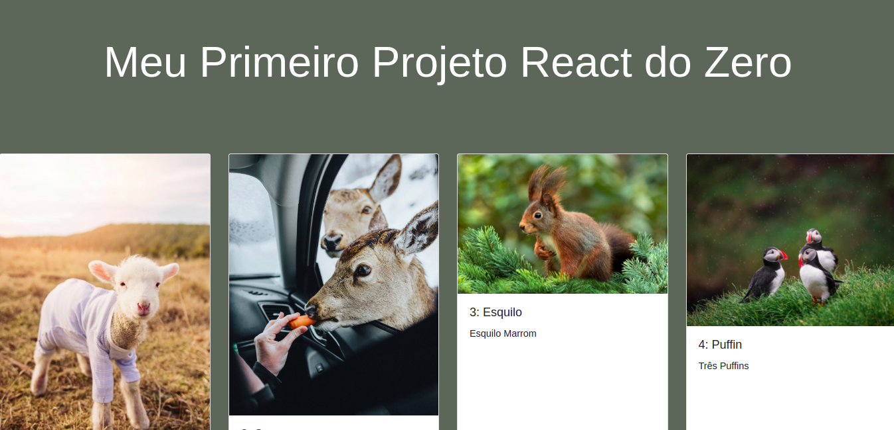
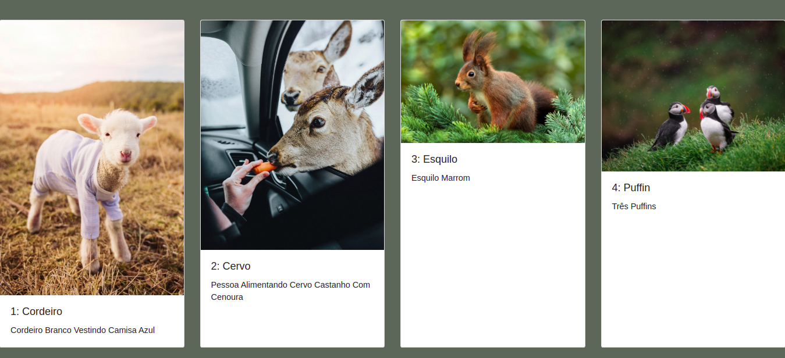

## Usando React pela primeira vez na {reprograma} 👾

Neste repositório foi feito um projeto simples para treinar React e suas especificidades. 💻

O projeto foi feito do zero com o uso do comando:
> yarn create react-app my-app 

Onde, após o processo de criação do projeto, algumas pastas e arquivos desnecessários foram excluidos e então foi feito o desafio proposto pela professora da {reprograma} que está descrito neste [repositorio](https://github.com/larigit/On10-TodasEmTEch-ReactI).

Neste projeto, foi feita componentização para melhor aproveitamento e clareza do código. Também foi utilizado o 'react bootstrap' para estilização da página. 
##
### Tecnologias Utilizadas: 👩‍💻
- HTML
- JavaScript
- React
- React Bootstrap

O resultado você pode conferir neste [link]().

Abaixo, fotos da página: 

